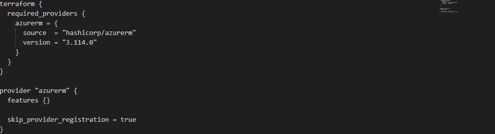

# Azure Storage Account Creation using Terraform
This project demonstrates how to create an Azure Storage Account using Terraform. It includes the necessary Terraform configurations to set up a standard storage account and an Azure Data Lake Storage Gen2 account within a specified resource group on Azure.

## Prerequisites
Before you can deploy this Terraform configuration, you need to have the following installed:

Terraform (version 0.12 or later)
An Azure subscription
Azure CLI (for authentication)

## Terraform Configuration
Provider Configuration
The provider.tf file configures the AzureRM provider:

This configuration ensures that the AzureRM provider is set up and skips the provider registration step to speed up the deployment process.

## Main Configuration
The main.tf file contains the main Terraform configuration to create the following resources:

 

 

1. Azure Resource Group

This block creates a resource group named oyawales in the uksouth region.

2. Standard Storage Account

This block creates a standard storage account named oyas with geo-redundant storage (GRS) in the resource group oyawales.

3. Azure Data Lake Storage Gen2 Account

This block creates an Azure Data Lake Storage Gen2 account with locally-redundant storage (LRS).

4. Data Lake Gen2 File System

This block creates a file system (container) within the storage account oyas.

## Deployment Steps

1. Initialize Terraform: Run the following command to initialize the Terraform working directory.

2. Plan the Deployment: Generate and review an execution plan using:

3. Apply the Configuration: Execute the plan to create the resources in Azure.

### Note
Ensure that your storage account names are globally unique.
Modify the resource names and configurations as per your requirements.

